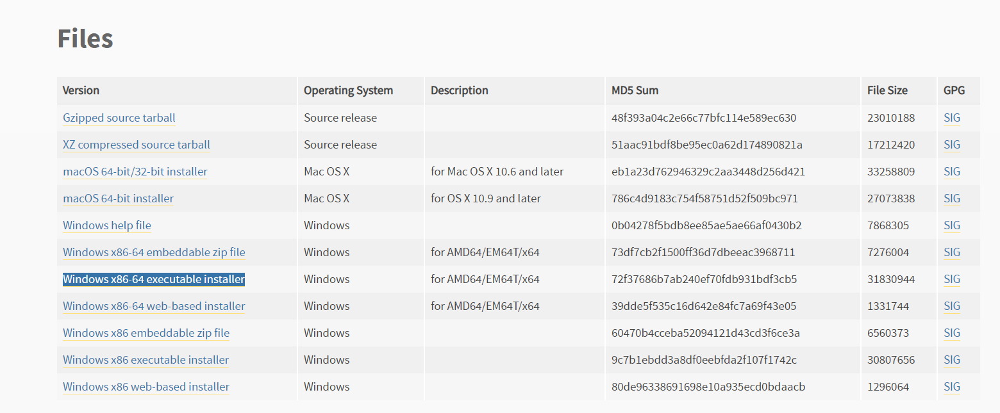
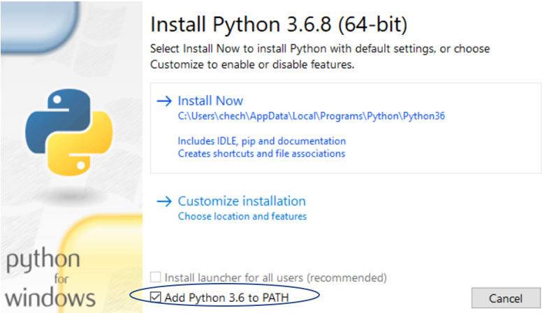
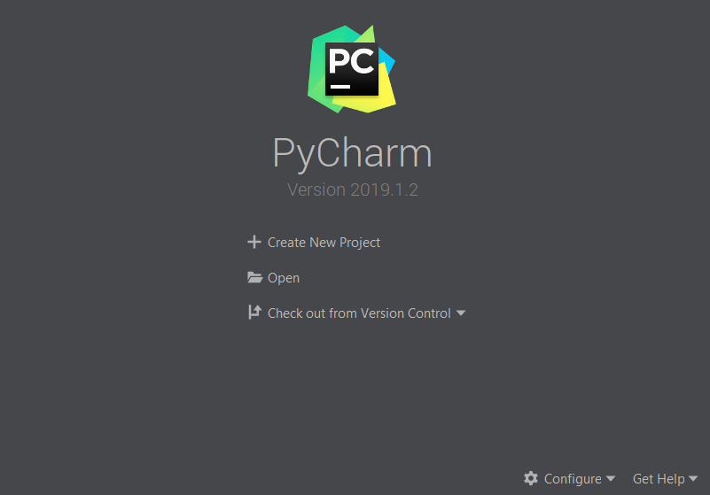
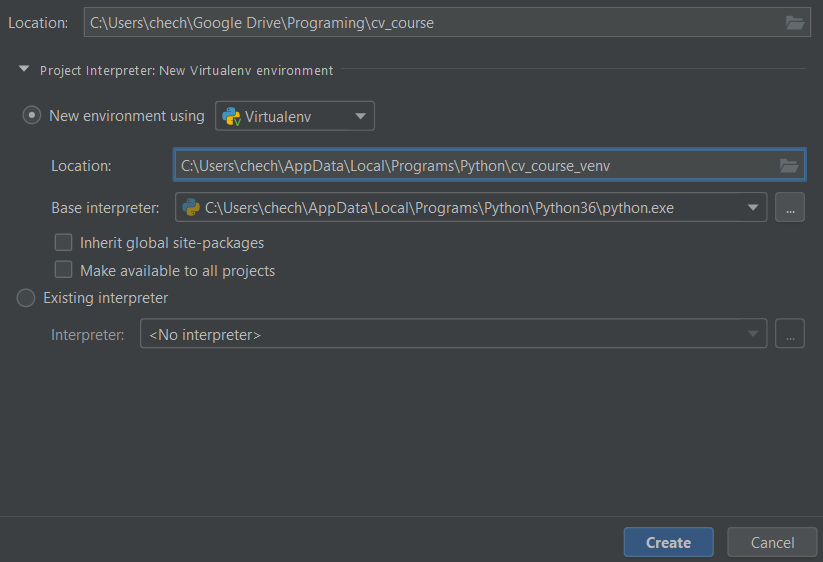
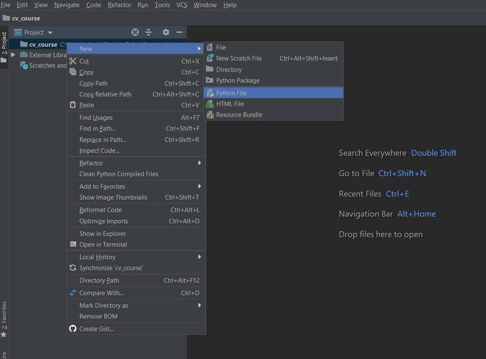
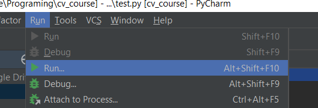
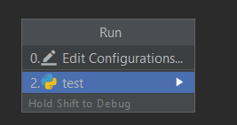

 
- [Install python 3.6.8 interpreter](#install-python-368-interpreter)
- [Install PyCharm community IDE](#install-pycharm-community-ide)
  - [First test script](#first-test-script)
- [Install python packages](#install-python-packages)
  - [Test package installation](#test-package-installation)

## Install python 3.6.8 interpreter

Python interpreter is the program that will run our actual Python code. The default downloaded interpreter is also called “base interpreter”, and for each project it’s recommended to open a new virtual environment (“venv”) with its own “project interpreter”.

1. Download install .exe from: <https://www.python.org/downloads/release/python-368/> -> go to end of page -> download “Windows x86-64 executable installer”.

 (we are installing 3.6.8 and  not the latest 3.7 because it has compatibility issues with tensorflow).
2. Open installer -> **check the “add Python 3.6 to Path”** -> click “Install Now” -> press “next” if needed until finish.
 <br/>
(it is preferable to download the python base interpreter to the installer’s suggested place if you don’t have default admin privileges on the computer [i.e.: C:\Users\chech\AppData\Local\Programs\Python])

## Install PyCharm community IDE

1. Download **PyCharm community** from: <https://www.jetbrains.com/pycharm/download/#section=windows.>
2. Press “next” until finished.
3. Open PyCharm -> “create a new project”   

4. Choose the project location -> open “project interpreter …” sub panel -> “new environment…” -> choose location for new environment (I like to put it next to the base interpreter) -> choose base interpreter (the one that was downloaded in section 1) -> click “create”.


### First test script

1. Open a new python file called “test.py”


2. Write:

    ```python
    print("hello world")
    ```

3. Choose Run -> run…\


4. Choose test\


5. You should see the output “hello world” on the cmd.

## Install python packages

Packages are the main way to get nontrivial functions that we are going to use, like:

- Numpy: for matrix and vector operations
- Matplotlib: for graph visualization
- Cv2: for image processing tasks
- Tensorflow: for neural networks

We can download all this with the “pip” program (which came with the python interpreter)- the python package manager.

1. Open the terminal view
2. Check that you are indeed in the right “venv” (will appear in brackets in the cmd), and install all packages with `pip install <package_name>`

- `pip install matplotlib` (will also install numpy…)
- `pip install tensorflow` (a GPU enabled package also exists, try installing it yourself if you wish- it’s not for beginners)
- `pip install opencv-python`

### Test package installation

Change test.py to this code:

```python
import tensorflow as tf
import numpy as np
import matplotlib.pyplot as plt
import cv2

print("hello world")
```

If all installation went well, you should see  “hello world" in the cmd.
